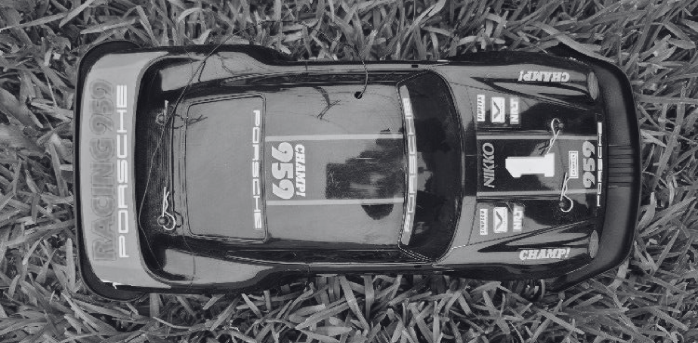

### We had a working economic system. Then we forgot it existed.
There's a darkness that hangs over wealth within families. A materialist corruption of trust.

When I was a child, my brothers and I operated what I now call the [[Lexicon/one-vault|one-vault economy]]. Typically after every holiday, all our money went into a single reserve. I would put them in a wallet and hide it in our Porsche remote-controlled car. It would unclip to reveal a hollow just above the chassis. And the money would just live there. In plain sight, unregulated by my parents. My brothers knew exactly where it was. 

They never counted it. They didn't need to. Somehow trusted me completely to keep it. I wonder why it seems so absurd now or why it seemed so normal then. 

Naively, this was a functioning economic model with zero overhead costs.
#### The One-Vault System 
The mechanics were simple but profound:
1. **Pooled Capital**: All income merged into a single reserve
2. **Fluid Allocation**: Anyone could access funds based on need, not permission
3. **Implicit Transparency**: The vault's location was known; its contents were trusted
4. **Organic Governance**: Spending decisions emerged from relationship dynamics, not contracts
5. **Witness**: We were each other's witnesses. Guarantors of truth

The strange thing is, I was the major spender. My brothers rarely wanted anything. Even though they had open access to the money, they would rarely want anything or ask for something. 

There was a sense of "one-product for all". When I did spend. On food mostly or whatever caught my attention, it was understood that everything was shared. It became communal property by default. For example. If I bought a phone, eventually it would get passed down.  I'd drag them. To new restaurants, bring food home, to try new things. Not out of guilt, but genuine curiosity. They didn't seek these things themselves. 

The one-vault stored shared potential. Capital allocation toward maximised collective utility. 
#### The Infection
The one-vault system began dying long before I noticed.

As we grew older, something changed. We imported concepts without realising it. 

Spending habits changed. We were not kids anymore. I fanatically assumed we still operated on the childhood system we'd built together. I presumed, we kept the ideas we grew up on. However, I realised that the brothers were over it for a while now. I did not understand when and why this changed.

With bank accounts, salaries, and "personal finances", we unconsciously adopted the [[Lexicon/pathological-deviation|Western model]]: atomised wealth, individual ownership, transactional hacking. Now the money was "mine" before it was "ours."

We had already accepted the individualist framework.

Dismembering the sacred system. 

We'd absorbed different diseases. Learned "scarcity" (less money, less choice). And "ownership" (I earn, therefore I allocate). Both corruptions of the original system, where no individual "owned" the money because everyone did.

Then, came independence. The one-vault system had become a fantasy. We'd started seeing money as "mine versus his."

**The Generational Transfer of Distrust**
The final blow came from inheritance drama. The distrust between uncles. Once brothers like us. The mindset left a nasty imprint on the psyche. If _those_ brothers couldn't maintain trust, how could we?

This is the insidious power of individualist thinking: the betrayal between elders retroactively "proved" that collective systems were naive. The one-vault economy didn't gradually fade. It was murdered by suspicion, contracts, and zero-sum thinking.

We inherited the wrong lesson. Instead of learning "trust can be broken, things change, so document and restore it," we learned "trust is childish, people grow up to be self-serving, so protect yourself."

---
Can't just go by family drama. Because money matters are always there. We have two types: _amanah_ (money for money loan) and _mudarabah_ (money contract for business with risk/profit). Additionally, there must be one witness and documentation. Simple. See what we missed. Which we now bear. At every transaction, documentation matters. Even a WhatsApp text is enough for short term moves. 

All assets are for actionable outcomes, proper use. Time is more important than money. In my opinion.

Zero balance is the victim mindset. So much leverage. Just has to be used in a responsible way. 

Just idealising integrity is wishful thinking. It just becomes an excuse for wasting time. We need high level of integrity in action. 

I think we are able to achieve larger when worked as a collective. 