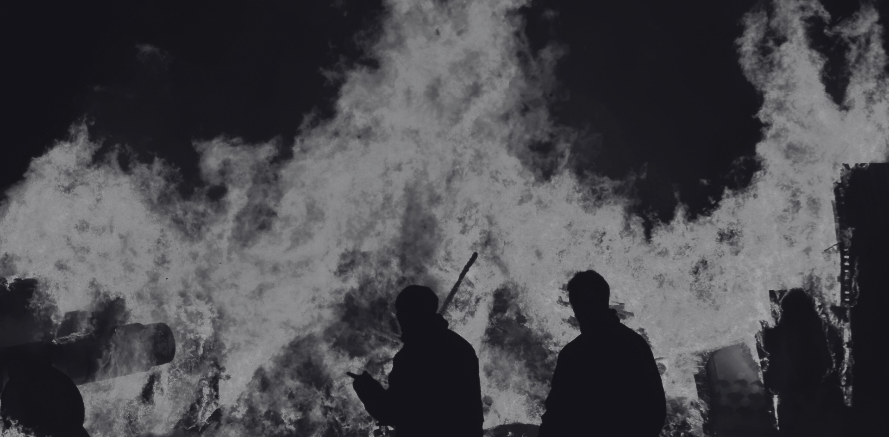

# Somewhere Down the Line
Somewhere down the line, I misunderstood the purpose of life.

I kind of know exactly when it happened. I can pinpoint almost exactly when I took the wrong turn and everything went sideways. It was gradual. A slow drift away from whatever centre I used to have, until one day I woke up and realised I was completely lost.

The idea of people is weird.

Back in Saudi, everything felt so peaceful. There was no noise on the streets. No honking. Nobody yelling at each other unless provoked. Nobody provoking each other. No one feeling the need to provoke anyone in the first place. Everything seemed so calm, clean, organised. Just perfect.

Then there's India. The opposite in every way. Chaos. Noise. Humans spilling over themselves in every direction. Pushing, yelling, surviving, deceiving, thriving in the mess of it all.

These two drastically polar worlds. People from these worlds would never get along. And me, stuck in limbo between them. I couldn't confine myself to one box or the other, so I made my own little world. Never belonged. Always curious. Forever seeking something I couldn't name.

---
I was happier then.

I wasn't any less miserable, but happy people made it feel better. The abundance of everything I took for granted: civility, system, comfort, security, connection. I had people around me. Friends. Family. A sense that tomorrow would be like today, and that was okay.

Till those people faded away over time. One after the other. Some moved. Some changed. Some I pushed away. Some just disappeared into their own lives, and I into mine.

The world I want to go back to doesn't exist anymore. Maybe it never did. Maybe it was just a figment of my imagination. A version of the past that I've polished and perfected in memory until it bears no resemblance to what actually was.

Now over the years all this dread has slowly become a part of me. 

I found myself manoeuvring through this chaos. Somewhere in between. Always moving, never settling. Always day-dreaming about getting away from it all. Sometimes I'm not even sure if it's about the place, the country, or life itself.

---
I am at peace and motivated only in high-stakes situations.

The mundane drives me crazy. When things are stable, when life is quiet and predictable, I feel like I have no control. 

Forever lost in this maze of productivity and ambition. Somewhere along the way, I lost sight of the bigger picture. To be human. To connect. To feel things without analysing them. To emote without calculating the cost.

I let dreams overshadow everything else. The delusions of the physical world. In chasing highs, I lost the very things that made life worth living in the first place.

It is the normal that drives me mad. The everyday. The routine. 

I find myself craving something new all the time. The next thing. An adventure. Some adrenaline. A real connection. Just some time outside my head. A few genuine laughs.

We used to laugh so much. My friends and I. My brothers. Even my father, in his quiet way. But now it all seems so pointless. Like laughter is just noise we make to fill the silence, and the silence is more honest anyway.

---
For a second there, I took a hard stumble. 

I was surprised, seeing my own programming, the psyop I was programmed into. Falling for the oldest trick in the book. Love.

What a mean joke.

Putting purpose in the back seat. Years wasted building walls in a land occupied by fantasy. Giving my whims complete power to destroy me. 

That was the weakest I've ever been. Another delusion. Another trap.

This is the cycle we are trapped in. The test I kept failing.

Maybe I'll learn. Maybe I won't.

Mistake was romanticising it. Pretending it's some beautiful tragic story.

It's just weakness. Untamed beauty. A tool for abusing a man's weakness.

That's the truth.

---
Holding small talk conversations make me feel like running for the hills. 

I would love to get into deep talks. The kind where you dissect ideas and emotions and figure out what we're all doing here. But now I think about how much I drain myself opening up like that to every person. Trying to build something real, only to watch it fail like it was just not meant to be.

I know I should stop calculating everything. Stop weighing every interaction for its potential return. 

But I  just can't walk in the metaphorical garden, feet touching the wet green grass, where there are no fences and thoughts can roam free without the need to be controlled. Like sheep, assembled for the wolves.

Perhaps this is the process. The struggles of ego are not meant to be easy.

That's what I tell myself. What my father learned. What I'm learning now, in my own broken way.

Life isn't fair, and waiting for fairness is just another way of waiting for the end.

---
So here I am.

Chasing highs. In some future version of myself where I've finally gotten myself together. Anything but now. Here. In this mess.

Again and again, chasing the impossible. Self-destructing at the first chance I get. I see it now. The pattern. The trap I've built for myself.

And only seeing it from a mirror of a distant past.

Maybe not toward redemption. Not yet.

But toward something.

Somewhere down the line, I misunderstood the purpose of life.